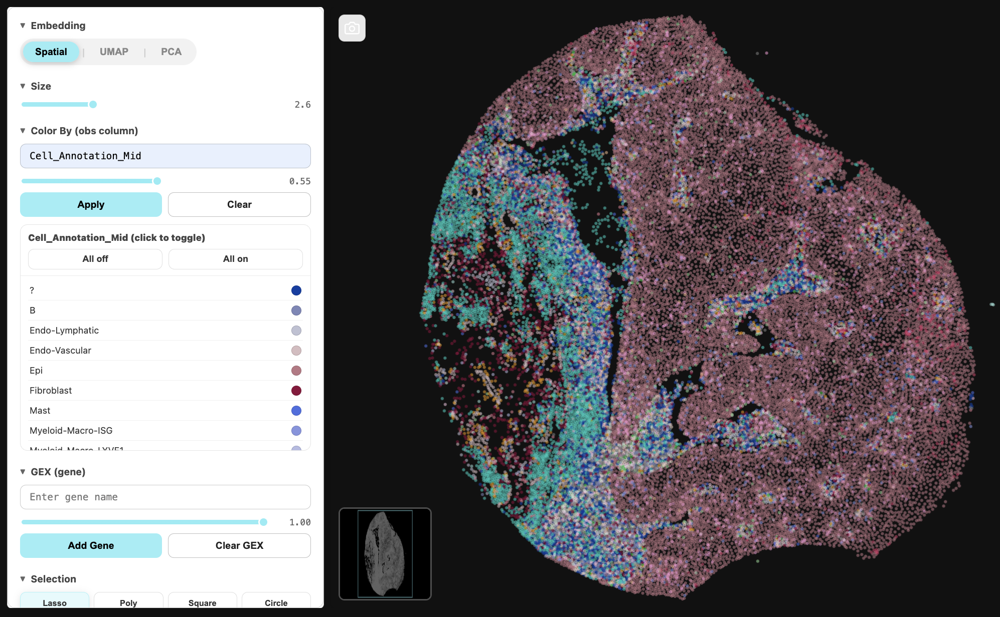

# Py_Anndata_Visualizer

> Inspired by Xenium Explorer and CellxGene. Designed for scientific research and exploratory data analysis.

<p align="center">
  
</p>

# 🔬 PyAnnData Visualizer - User Guide

**An interactive spatial plotting tool for single-cell data analysis**

---

## Getting Started

### Prerequisites
- Pre-annotated AnnData object with spatial coordinates
- For large datasets, consider subsetting to a region of interest (e.g., individual tissue section from TMA)
- Works with both spatial and standard single-cell data

## Recommended: Conda Installation
```bash
# 1. Create environment
conda create -n anndata-viz python=3.10
conda activate anndata-viz

# 2. Install dependencies via conda
conda install -c conda-forge scanpy jupyterlab ipywidgets

# 3. Install visualizer
pip install git+https://github.com/Zach-Sten/py_anndata_visualizer.git

# 4. Launch Jupyter
jupyter lab
```

### Basic Workflow

#### 1️⃣ Color by Cell Annotations
- Enter an `obs` column name (e.g., `"cell_type"`)
- Click **Apply** to visualize
- Existing color schemes will load automatically
- Default colors assigned if none exist
- Toggle categories on/off in the legend

#### 2️⃣ Visualize Gene Expression
- Type a gene name from `adata.var_names`
- Click **Add Gene** to overlay expression (viridis colormap)
- Click gene chips to toggle visualization
- Combine with obs coloring for dual-layer views

#### 3️⃣ Switch Embeddings
- Toggle between **Spatial**, **UMAP**, and **PCA** views
- Smooth animated transitions preserve your color state
- Uses `adata.obsm['spatial']`, `adata.obsm['X_umap']`, `adata.obsm['X_pca']`

---

## Visualization Controls

### Navigation

| Action | Controls |
|--------|----------|
| **Zoom** | Mouse wheel / trackpad pinch |
| **Reset Zoom** | Double-click |
| **Pan** | Click + drag on plot |
| **Point Size** | Slider or ← → arrow keys |
| **Rotate** | Press `R`, move mouse, click to lock |
| **Reset Rotation** | Double-tap `R` or double-click |
| **Export Image** | Click 📷 camera button |

> 💡 **Tip**: The minimap (bottom-left) shows your current view position

---

## Selection Tools

### Creating Selections

1. **Choose a tool**: Lasso (✓ recommended), Rectangle (✓ recommended), Polygon (🚧 beta), Circle (🚧 beta)
2. **Draw on plot**: Click/drag to create closed regions
3. **Important**: Only **visible points** are selectable (respect category toggles)
4. **Deselect tool**: Click tool again to return to pan mode

### Managing Selections

| Action | How To |
|--------|--------|
| **Rename** | Double-click selection chip |
| **Multi-select** | Shift + click selections |
| **Group** | Multi-select, then click **Group** |
| **Save to AnnData** | Click **Save** on group folder |
| **Delete** | Click **×** on selection/group |

### Saving Groups to AnnData

- Grouped selections create a new `adata.obs` column
- Group name becomes the column name
- Individual selection names become category labels
- Unselected cells are labeled as `NaN`

---

## 🔧 Tips & Best Practices

✅ **Do:**
- Use lasso/rectangle tools for reliable selections
- Turn off unwanted categories before selecting
- Group related selections before saving

⚠️ **Note:**
- As of right now color schemes cannot be changed in-app (use `adata.uns` colors)
- Polygon/circle tools are experimental features and should be used cautiously.
- Large datasets (>100K cells) may be slow and therefore we reccomend using subsets of data for now.

---

## Keyboard Shortcuts

| Key | Action |
|-----|--------|
| `←` `→` | Adjust point size |
| `R` | Toggle rotation mode |
| `R` `R` | Reset rotation |

---

## 📦 Requirements

```
Python ≥3.8
numpy, pandas, scipy
ipywidgets, IPython
```

---

## 🐛 Troubleshooting

**Controls not loading?**
- Try turning debug to TRUE and use fn + f12 to get a detailed report in your browsers consle.

**Performance issues?**
- Subset your data to <100K cells
- Use lower resolution embeddings

---

## 📝 Development Status

This tool is under active development! Features are evolving rapidly.
- Coming: Custom colormaps, advanced filtering
- Coming: Better data loading large datasets
- Coming: Polygons and shapes for segmentation masks.
- Coming: Size bars and measurements for distances.

---

## Example Usage

```python
from py_anndata_visualizer import create_adata_interface
import scanpy as sc

# Load your spatial dataset
adata = sc.datasets.visium_sge()

# Create interactive visualizer
create_adata_interface(adata, figsize=(900, 600))
```

---

**Questions or feedback?** Open an issue on GitHub or contact the development team.


