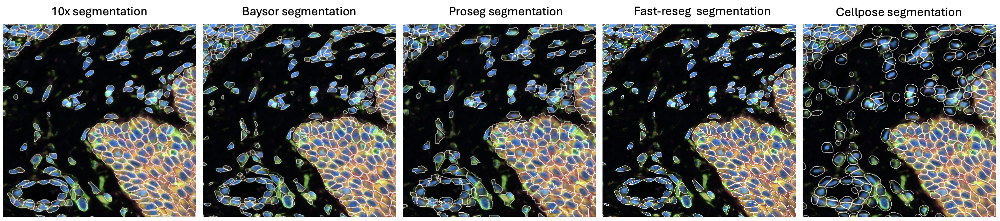
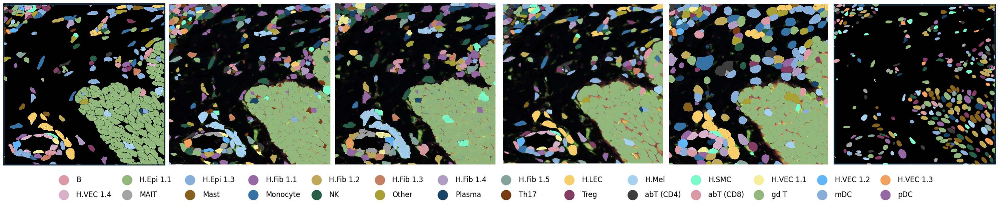
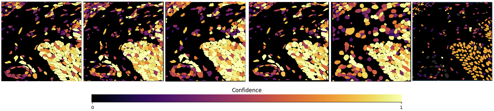

# Spatial Segmentation Wizard


An interactive pipeline for running and benchmarking multiple spatial transcriptomics segmentation methods on HPC clusters via SLURM. All methods execute inside a single Singularity container.

We're working on adding in a docker container as well and are excited to implement a classifier that builds off of reference data to give quick annotations for downstream QC metrics. Stay tuned for more! ✨🪄💫✨

Suggestions for QC elements or methods to add are always welcome! 

<br clear="left">

## Overview

The pipeline wraps multiple segmentation methods behind a single interactive wizard. Point it at your data, pick your methods, and it generates and submits all SLURM jobs — one per sample per method — with automatic dependency chaining so QC runs after segmentation finishes.

## Comparisons
All new segmentation masks can be viewed in Xenium explorer for quick visual assessments.
<p align="center">
  
</p>

#### Annotations:
If a refrence dataset is used we can also quickly spot annotations made by the classifier and their confidence. Here we use a rank based gradient boosting classifier to identify cells quickly.
<p align="center">
  
</p>
<p align="center">
  
</p>
## Current Status

**Working:**
- **ProSeg** — probabilistic segmentation, full Explorer export (https://www.nature.com/articles/s41592-025-02697-0)
- **Baysor** — Bayesian transcript-based segmentation, dask-parallelized (https://www.nature.com/articles/s41587-021-01044-w)
- **Xenium baseline** — native Xenium segmentation loaded as reference
- **Fastreseg** - R based program that uses a reference dataset to match cell types (https://www.nature.com/articles/s41598-025-08733-5)
- **Cellpose** - neural net model to fit segmentation boundaries by expansion of nuclear mask (https://www.nature.com/articles/s41592-020-01018-x)
- **QC report** — automated 4-page PDF comparing all methods, emailed on completion
  - Basic metrics: cell count, genes/cell, counts/cell, % transcripts captured
  - Morphological metrics: cell area, elongation, circularity, compactness, eccentricity, solidity, convexity, density, nuclear ratio
  - All metrics computed from segmentation boundary geometry in Python (shapely)
  - Guide pages interleaved with data pages for interpretation context
- **Notifications** — email on job start, finish, and error; PDF for QC results attached on finish
- **Interactive wizard** — full config generation, sample discovery, job preview, and SLURM submission

**In progress:**
- Quick classifier from reference for cell type annotations needed for BIDCell, FastReseg integration (scripts present, validation ongoing)

## Supported Methods

| Method | Type | Status |
|--------|------|--------|
| **ProSeg** | Probabilistic (Rust, via SOPA) | ✓ Working |
| **Baysor** | Bayesian transcript-based (Julia, via SOPA) | ✓ Working |
| **Cellpose** | Neural network (Python, via SOPA) | ✓ Working |
| **FastReseg** | Post-hoc refinement (R) | ✓ Working |
| **BIDCell** | Deep learning (PyTorch) | In progress |


## Quick Start

```bash
pip install pyyaml  # only dependency outside the container

# Interactive wizard — walks you through everything:
python segmentation_wizard.py

# Or use an existing config:
python segmentation_wizard.py --config config/my_config.yaml
```

### Test locally (no HPC needed)

```bash
python setup_test_data.py
python segmentation_wizard.py --config config/test_config.yaml
ls scripts/slurm/generated/
```

## Output

Results are written into `{method}_reseg/` folders alongside your raw data. Raw data is never modified. Each completed sample produces:

| File | Description |
|------|-------------|
| `{sample_id}.h5ad` | AnnData count matrix |
| `cells.zarr.zip` | Cell boundaries for Xenium Explorer |
| `cell_feature_matrix.zarr.zip` | Count matrix for Explorer |
| `run_metadata_{method}.json` | Timing, parameters, SLURM job ID |

QC output per slide:
- `qc_report.pdf` — 4-page comparative report (emailed automatically)
- `morpho_{method}.csv` — per-cell morphological metrics for all methods
- `cellspa_{method}.csv` — basic count-based QC summary

## Architecture

```
segmentation_wizard.py      ← interactive wizard
        │
        ▼
config/*.yaml                        ← saved configurations
        │
        ▼
scripts/slurm/generated/             ← one .sh per sample × method
        │
        ▼  (singularity exec container.sif python ...)
scripts/python/
  run_proseg.py / run_baysor.py / run_cellpose.py / run_bidcell.py / run_qc.py
        │
        ▼
scripts/utils/
  data_io.py        ← shared loading, patching, aggregation, export
  config_loader.py  ← config parsing + sample discovery
  notify.py         ← email/SMS notifications
```

## Container

All segmentation methods run inside a single Singularity container (`container/Singularity_spatial_segmentation_v3`). Contains Python 3.10, SOPA, ProSeg, Baysor, Cellpose, BIDCell, FastReseg, CellSPA, scanpy, spatialdata, PyTorch + CUDA, R + spatial packages.


## Requirements

- **Local:** Python 3.7+ with `pyyaml`
- **HPC:** Singularity, SLURM, the built `.sif`
- **Notifications:** `sendmail` available on the cluster

## Future Plans
- Additional segmentation method integrations
- Expanded QC metrics and spatial analysis
